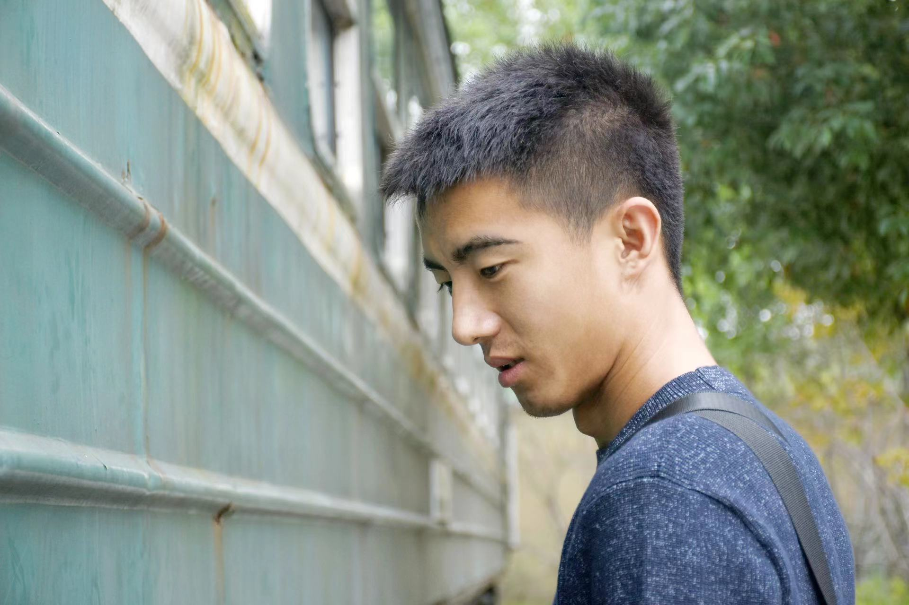
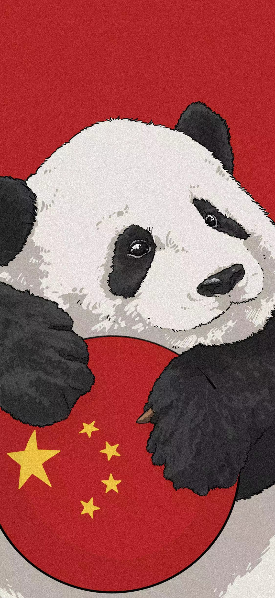

# :smile_cat:Welcome to Liuxin's Org repo

------

:red_circle: If you want to see photos in this markdown! Please access https://github.com/gtb-2022-liu-xin/.github/tree/main/profile. Thank you! :sunflower:

-----

## :o:Who am I?

- My name is Liuxin. And I am from Ningxia,China! I also have a nickname.-littleyao,because my gilrfirend's last name is yao. So I choose littleyao as my nickname.

- I also have a personal logo! Just as  below!

​		It is a little ugly and simple, but I like it. I made it by myself.

- I have my own web page. It can be accessed by the link https://www.littleyao.com. Surely, I buy this domain for my girl just as you can see. But it is embarrassed to say  it does not work. Because my aliyun's server is out of work. So maybe it will be accessible in some days.

- Oh,sorry, I forget  to add my photo. So  you can know what I  look  like below! 

​		Just  as what you see,I  am not a  good-looking man! Ha ha! But I want to be a  handsome one. I like live a easy life. I like to travel with my lover...

------

# :crying_cat_face:Other

- I like cute animal,Cat,little dog etc. And I will have some pets in future as below.

   It is so cute! Right? Hahahaha.....

- I also like Xi'an and Thoughtworks.So I join Thoughtworks in Xi'an.It is my luck to have an oppotunity to join Thoughtworks.To be a member of thoughtworksers.I expect my life in Thoughtworks will be good as my life in Xi'an.

- The most important thing, I love my country, my hometowm, my relatives and so on.Best wishes to my country!

  

---------

